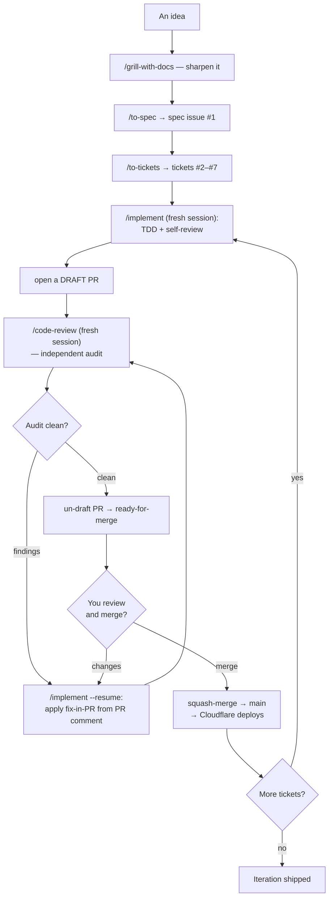
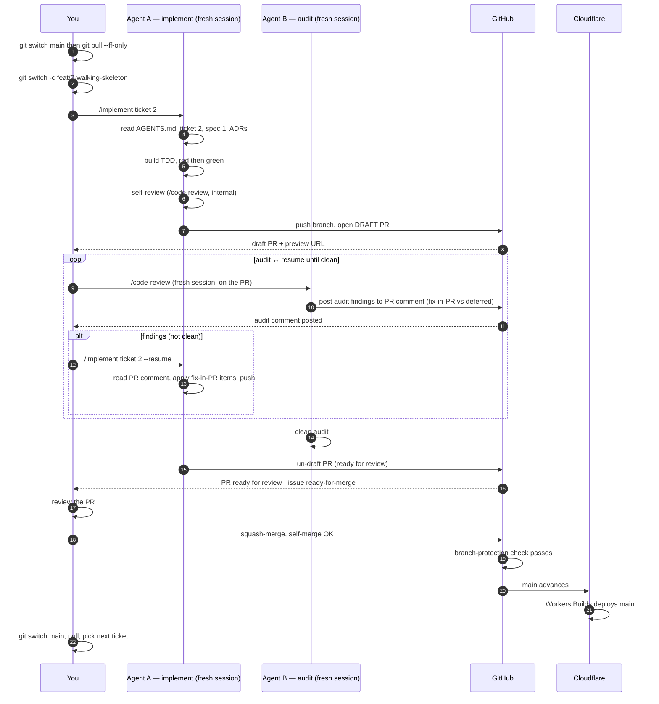

# Wordflare

A reusable, single-tenant blog engine on Cloudflare's native stack — **TypeScript**, **Workers + Static Assets**, **D1**, an Obsidian-style Markdown editor, and static HTML generated on publish.

> This README is the **how-to-work-here** guide. For *what* we're building, see the [spec (#1)](https://github.com/tediscript/wordflare/issues/1) and [`CONTEXT.md`](CONTEXT.md). For *why*, see the [ADRs](docs/adr/).

**TL;DR — to work on a ticket:** branch → `/implement #N` → review & merge the PR. `main` is protected; nothing lands except a squash-merged pull request.

---

## How work flows here

We work ticket-by-ticket, each on its own branch, merged by pull request. Two views:

### 1. The big picture — idea to ship



### 2. One ticket — who does what



---

## Working a ticket (the loop)

The build uses **maker-checker**. Two different reviews — named, so they stop reading like a contradiction:

- **Self-review** — `/code-review` run *internally* by `/implement` as a close-out, **before** the PR exists. Same session as the build, so it can rationalize its own work.
- **Independent audit** — `/code-review` run in a *fresh session* on the open PR, **after** implement. No shared context with the builder; posts findings to a **PR comment**. This is the one with teeth.

1. **Sync + branch** (you do this first — `/implement` commits to the *current* branch, so the branch must exist before it runs):
   ```
   git switch main && git pull --ff-only
   git switch -c feat/<ticket>-<slug>      # e.g. feat/2-walking-skeleton
   ```
2. **Session A — implement + self-review:** open a new session and run `/implement #<ticket>`. The agent reads `AGENTS.md` + the ticket, builds test-first (red-green), runs its built-in **self-review** (`/code-review` internally), then pushes the branch and opens a **draft** PR.
3. **Session B — independent audit:** in a *fresh* session, run `/code-review` on the PR. It audits the diff with no shared context and posts findings to a **PR comment**, split into *fix-in-PR* vs *deferred*.
4. **Session C — resume:** `/implement #<ticket> --resume` reads that PR comment and applies the *fix-in-PR* items. Loop **B ↔ C** until a fresh audit comes back clean.
5. **Clean audit → ready for merge:** un-draft the PR (mark "ready for review"); the issue moves to `ready-for-merge`.
6. **Review + merge** (you): check the PR, then squash-merge — self-merge is allowed:
   ```
   gh pr merge --squash --delete-branch
   ```
7. **Sync + next:** `git switch main && git pull --ff-only`, then pick the next frontier ticket (the board shows blocking edges).

The **PR comment is the handoff artifact** between sessions B and C — that's what makes the audit resumable across fresh contexts.

The label flow that tracks this loop (`in-implement` → `ready-for-audit` → `in-audit` → `ready-for-merge`) is defined in [`docs/agents/triage-labels.md`](docs/agents/triage-labels.md).

**Branch naming:** `feat/<ticket>-<slug>`, or `fix/`, `chore/`, `docs/` for non-ticket work. `main` is branch-protected — direct pushes are rejected, even for the owner. See [ADR-0003](docs/adr/0003-github-flow-pr-based-workflow.md).

---

## Local development

The runnable stack lives in this repo. The quickest path (see the `Makefile` for the full list — `make` prints it):

```sh
make setup   # install deps, create .dev.vars, apply local D1 migrations
make dev     # wrangler dev on http://127.0.0.1:8787
```

Then open:
- http://127.0.0.1:8787/ — the placeholder homepage (a Static Asset; the Worker isn't invoked).
- http://127.0.0.1:8787/__health — the walking-skeleton probe: `{"db":"ok","posts":N,"session_secret_set":true}` (HTTP `503` when the D1 probe fails).

`make` is a thin wrapper over the real commands:

| `make …` | runs | |
|---|---|---|
| `setup` | `npm install` + `.dev.vars` + migrations | first-time bootstrap |
| `dev` | `wrangler dev` | Worker + Static Assets on `:8787` |
| `test` | `npm test` | `@cloudflare/vitest-pool-workers` suite |
| `typecheck` | `tsc --noEmit` | type-check |
| `migrate` | `wrangler d1 migrations apply wordflare --local` | apply migrations |
| `db Q="…"` | `wrangler d1 execute wordflare --local --command "…"` | run SQL on local D1 |
| `health` | `curl /__health` | probe the running dev server |
| `stop` | kill this project's `wrangler dev` + `workerd` | free `:8787` if `make dev` says the port is in use |
| `clean` | `rm -rf .wrangler` | wipe local D1 state (re-run `make migrate`) |

Notes:
- `.dev.vars` — local secrets (session secret, password pepper). **Never commit** — it's in `.gitignore`. `make setup` copies `.dev.vars.example` only if `.dev.vars` is absent.
- No Cloudflare login is needed for local dev; only deploying (and creating the remote D1) requires `wrangler login`.

---

## Deploying

- `main` is deployed to production by **Cloudflare Workers Builds**; every PR/branch gets a preview URL.
- **One-time, before the first deploy:** `wrangler login` (interactive OAuth) and create the remote D1 database.
- After [#2](https://github.com/tediscript/wordflare/issues/2) merges, enable "require status checks" on `main` so CI gates every PR (see ADR-0003).

---

## Where things live

- [`CONTEXT.md`](CONTEXT.md) — domain glossary (Post, frontmatter, wikilink, Post Status, Roles & Capabilities…)
- [`docs/adr/`](docs/adr/) — architecture decisions
  - [0001 — Static generation via redeploy-on-publish](docs/adr/0001-static-generation-via-redeploy-on-publish.md)
  - [0002 — D1 is the source of truth](docs/adr/0002-d1-is-the-source-of-truth.md)
  - [0003 — GitHub Flow: PR-based workflow](docs/adr/0003-github-flow-pr-based-workflow.md)
- [`docs/specs/`](docs/specs/) — the iteration-1 spec (mirrors issue #1)
- [`docs/research/`](docs/research/) — the Cloudflare-stack research
- [Issues](https://github.com/tediscript/wordflare/issues) — the ticket board (spec #1, tickets #2–#7)

---

## Status

**Iteration 1 — planning complete, implementation not started.** Frontier ticket: **[#2 — Walking skeleton](https://github.com/tediscript/wordflare/issues/2)**.
